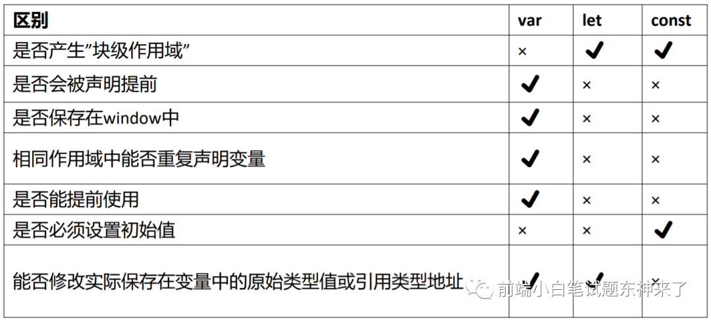

# 杂七杂八的题目的答案总结
## webpack与vite

`的区别，vite的原理，webpack迁移到vite的问题`

1. [区别](../vue/vue3/vite.md)
2. 迁移问题：

## js内存的存储

### AO
js底层存储数据的地方叫关联数组，是一个类似于对象的结构，通过键值对保存
局部变量会存储在函数作用域AO(actived Object)中
全局变量保存在window对象中

```
var a = 1
window.a = 1
```

### let const var 的区别
两者的区别，var定义的值可以在window中找到，但不能使用delete window.a 删除



## 微前端

[微前端框架-qiankun](https://github.com/umijs/qiankun)

`一种将独立的前端应用组成一个更大的整体的架构风格，将大的问题微小化`

**解决的问题**

1. 更方便的增量升级
1. 简单解耦的代码依赖，更容易维护
1. 可以独立部署，快速卸载
1. 垂直组建，各司其职

### web component规范

[web component官方文档](https://developer.mozilla.org/zh-CN/docs/Web/Web_Components)

1. 模板元素（templete,slot）
    + 模板中的内容默认是不加载的，它不在DOM结构中，需要手动加载
    + 可以编写不在呈现页面中显示的标记模板。然后它们可以作为自定义元素结构的基础被多次重用
    ```js
    // 获取父元素div
    var container=document.querySelector('#container1');
    // 获取模板元素
    var tmpl=document.querySelector('#template1');
    // 父元素挂载模板，true表示深拷贝
    container.appendChild(tmpl.content.cloneNode(true));
    ```
2. shadow DOM（影子DOM）

    `宿主元素可以用:host选择器来选择`
    ```js
    // 获取已有节点
    var host=document.querySelector('#host1');
    // 创建影子节点
    var shadowRoot=host.createShadowRoot();
    // 填充影子节点
    shadowRoot.innerHTML='hello';
    ```
3. HTML import（嵌入外部文档）

    `依赖浏览器支持HTML import特性`
    ```html
    <link id="link1" rel="import" href="fileName.html" >

    <div id="container1"></div>
    ```
    ```js
    var container=document.querySelector('#container1');
    var externalDocument=document.querySelector('#link1').import;
    // ...获取所有元素
    container.appendChild(externalDocument.querySelector('...').cloneNode(true));
    ```

4. 自定义元素
    ```js
    // 创建元素
    var element = object.create(HTMLElement.prototype)
    Object.defineProperty(element,'title',{
      writable:true
    })
    // 创建生命周期方法
    element.createCallback = function(){

    }
    // 注册新元素
    // document.registerElement方法可以向文档注册元素
    let newEl = element.registerElement('new-el',{
      // 原型为新创建的元素
      prototype:element,
      // 可以继承自新创建的元素或者一个原生元素
      extends:'span'
    })

    // 使用
    // 方法1，直接使用
    <new-el></new-el>
    // 方法2，插入body中
    let newElElement = new newEl()
    newElElment.innerHTML = '<h1>内容</h1>'
    document.body.appendChild('newElElEment')
    // 方法3，当继承自某一元素时的使用方法（is属性），与方法一效果相同，也会触发生命周期函数
    <span is="new-el"></span>
    ```
5. css选择器（用于上面几种方法的选择器）

    `Shadow DOM是:host的伪元素，而不是子元素，因此:host::shadow中间不能加空格`
    ```css
    /* 自定义元素加入到DOM之前是有一个resolve过程，过程中可以加入提示文字 */
    my-name:unresolved::after{
        content:'Registering Element ...';
        color:red;
    }
    :host shadowDOM 的宿主元素
    :host::shadow 获取shadowDOM 伪元素
    :host::content 获取content 伪元素
    ```
6. 备注：关于CSS的单双冒号问题

    `单双冒号是为了区分伪类与伪元素，双冒号是CSS3之后的，如果要全部兼容还是单冒号双冒号都用，双冒号是CSS3对伪元素的规定`

    **伪类**：为选择器加上特殊效果（:active,:hover等，是对应的选择器的某一种特殊状态）

    **伪元素**：将特殊效果添加到选择器上（:before,:after等，为选择器前后增加内容或特殊样式）


## js内存分配
1. 基本数据类型存储在栈中
2. 引用类型变量的值存储在堆
3. 引用类型的指针依然在栈内存中


## js垃圾回收机制
### 标记清除
1. GC（垃圾收集器）在运行时给所有的变量都加上一个标记，假设所有内存里的变量都是垃圾，标记为0。
1. 从根对象开始遍历，把不是垃圾的标位1，是垃圾的标记为0，为零时销毁它所占用的空间
1. 最后把内存里所有对象标记为0，等待下一轮遍历
**优点**：实现简单，只要标不标记的区别
**缺点**：垃圾清除后变量所占用的内存被清理，但是内存的位置并不会变化，导致清除出来的内存空间是不连续的，导致了内存分配问题
`标记整理算法`，是对标记清除的补充，会将无需清除的变量向内存的一端移动，然后清除其他的内存
### 引用计数
1. 声明一个变量并且将引用类型赋值给变量时，引用次数为1
1. 同一个值又赋值给另一个变量，引用数加1
1. 值被其他变量覆盖，次数减1
1. 引用数为0时被清除
**优点**：立即的垃圾回收，不需等GC遍历全部对象
**缺点**：需要计数器并且无法预测计数器的范围、无法解决循环引用的问题

### 回收机制的优化
**分代式垃圾回收**：将对象分为存在时间短（1M-8M）的与时间长的分别用两个垃圾回收器管理
1. 新生代
  + 将内存一分为二，分为使用区与空闲区
  + 使用区快满时执行垃圾清理
  + 对使用区的对象进行计数然后复制到空闲区，两区调换角色
  + 一个对象多次复制后依然存在，转移到存活时间长的区域
  + 如果一个对象占比超过当前区域的25%，也直接转移到时间长的区域（为了不影响后续内存分配）

2. 老生代
  + 使用标记整理算法清除（消除空闲内存）

**并行回收**：开启辅助线程帮助回收，但还是会阻塞主线程js代码的执行


## fetch的封装与中断请求
