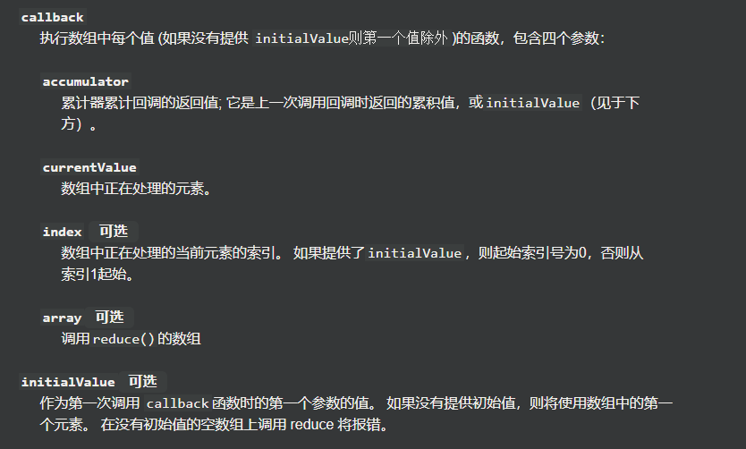

# Array
## 遍历数组
### every
+ 数组所有元素是否符合某一条件，返回true/false
### some
+ 数组中一个元素是否符合某一条件，返回true/false
### filter
+ 对数组所有元素执行方法，改变原数组
### find
+ 遍历数组找到符合条件的值，不会全部遍历，改变原数组
### map
+ 为数组所有元素执行方法，不会改变原数组，当元素时引用类型时，会改变原数组，没有返回值
### flatMap
+ 遍历数组，对结果扁平化处理，可在遍历过程中对数组每一项进行处理
```js
// Let's say we want to remove all the negative numbers and split the odd numbers into an even number and a 1
let a = [5, 4, -3, 20, 17, -33, -4, 18]
//       |\  \  x   |  | \   x   x   |
//      [4,1, 4,   20, 16, 1,       18]

a.flatMap( (n) =>
  (n < 0) ?      [] :
  (n % 2 == 0) ? [n] :
                 [n-1, 1]
)

// expected output: [4, 1, 4, 20, 16, 1, 18]
```
### flat
+ 数组扁平化，参数为扁平化处理层级

### keys
+ 索引的遍历，会包含没有值得项
### values
+ 值的遍历

### reduce
`参数`

**说明** initialValue可以指明第一个参数的内容